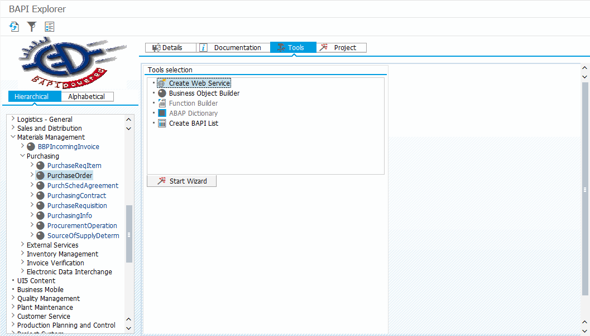

# Exposing an RFC module via as a SOAP webservice

## Create an enterprise service

### Option 1: via `BAPI` from a business object

1. Go to transaction `BAPI`. 
2. Browse or search for the desired business object. Select the entire business object or one of the methods
3. In tab `Tools` select `Create Web Service` and press `Start Wizard`
4. Follow the wizzard.



### Option 2: via `SE80` from a function module or BAPI

Go to transaction `SE80`, change to Package view and right-click the package, where you want to place your webservice. If you do not have a package yet, use `SE21` to create one.

In the context menu for the package select Create > Enterprise Service. Follow the wizzard, making the following selections:

- Objekttyp: Service-Provider
- Art des Service-Provide: Vorhandenes ABAP-Objekt (Inside Out)
- Service-Definition: Eindeutiger Name des Webservices (e.g. ZEXFACE_MY_SERVICE)
- Endpointtyp: Funktionsbaustein

Complete the wizzard and save your package.

Finally, activate your service by right-clicking it below your package and selecting `Activate` in the menu.

## Make the webservice accessible

Go to transaction `SOAMANAGER`. Click on the link `Simplified Web Service configuration` within the tab `Service Administration`. Search for your service, activate the checkbox for the desired authentication type and press `Save`. Now your webservice is accessible from outside.

### Troubleshooting

If `SOAMANAGER` is not accessible (shows the HTTP error 403), it needs to be activated first: go to transaction `SICF`, navigate to `sap/bc/webdynpro/sap/appl_soap_management`, right-click the service and select `Activate`.

## Get the URLs

You will need to URL: one to access the webservice and one for it's WSDL description.

In the `Simplified Web Service configuration` of the `SOAMANAGER` select your service and click on the button `Show Information`. Here you can find everything needed to access the service.

## Test the webservice

### Using Postman

1. Create a new POST-request with the URL of your webservice. 
2. Choose the desired authentication method in the tab `Authorization`.
3. Under `Headers` add `Content-Type: text/xml`
4. In the tab `Body` switch to raw and place the SOAP XML into the body. 
5. Press Send

Here is a minimalistic example XML. Just replace `BAPI_USER_GETLIST` with the name of the desired RFC module.

```xml
<soapenv:Envelope xmlns:soapenv="http://schemas.xmlsoap.org/soap/envelope/" xmlns:urn="urn:sap-com:document:sap:rfc:functions">
	<soapenv:Header></soapenv:Header>
	<soapenv:Body>
		<urn:BAPI_USER_GETLIST>
		</urn:BAPI_USER_GETLIST>
	</soapenv:Body>
</soapenv:Envelope>
``` 

### Troubleshooting

- SAP Errors like "class not found": Go to transaction `SICF` and search or browse for your service. Make sure, all nodes above your service are activated (not greyed-out). If not, activate them by right-clicking and selecting `Activate`.
- HTTP Error "Unexpected media type": did you forget to set the requrest header `Content-Type: text/xml`?

